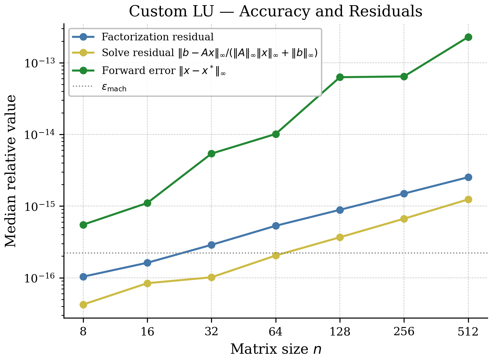
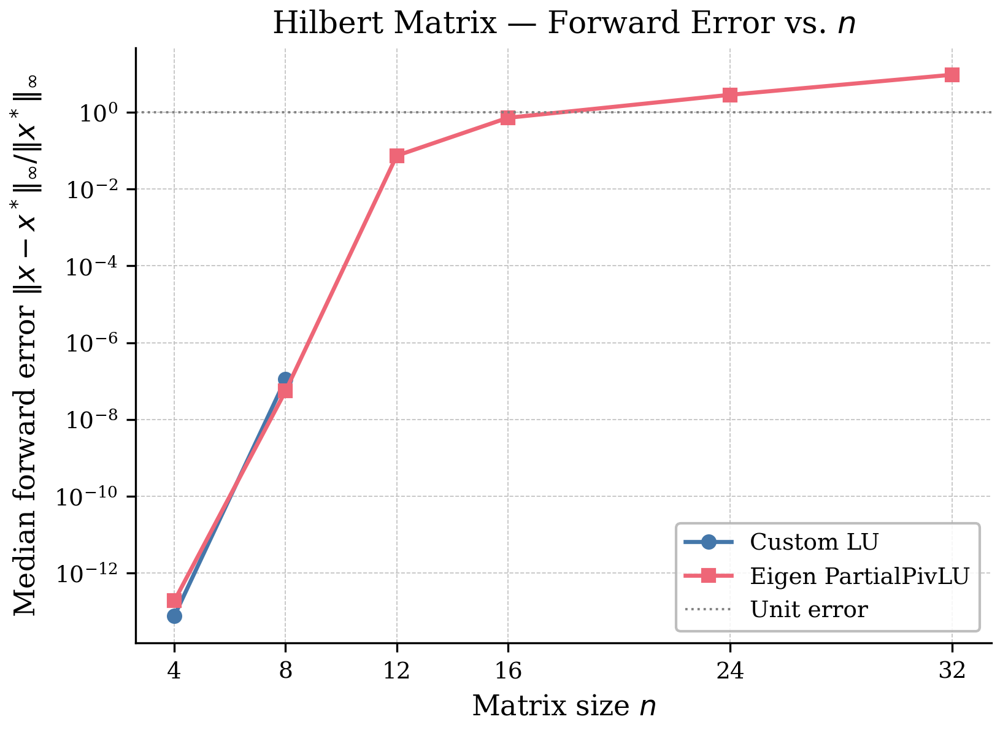
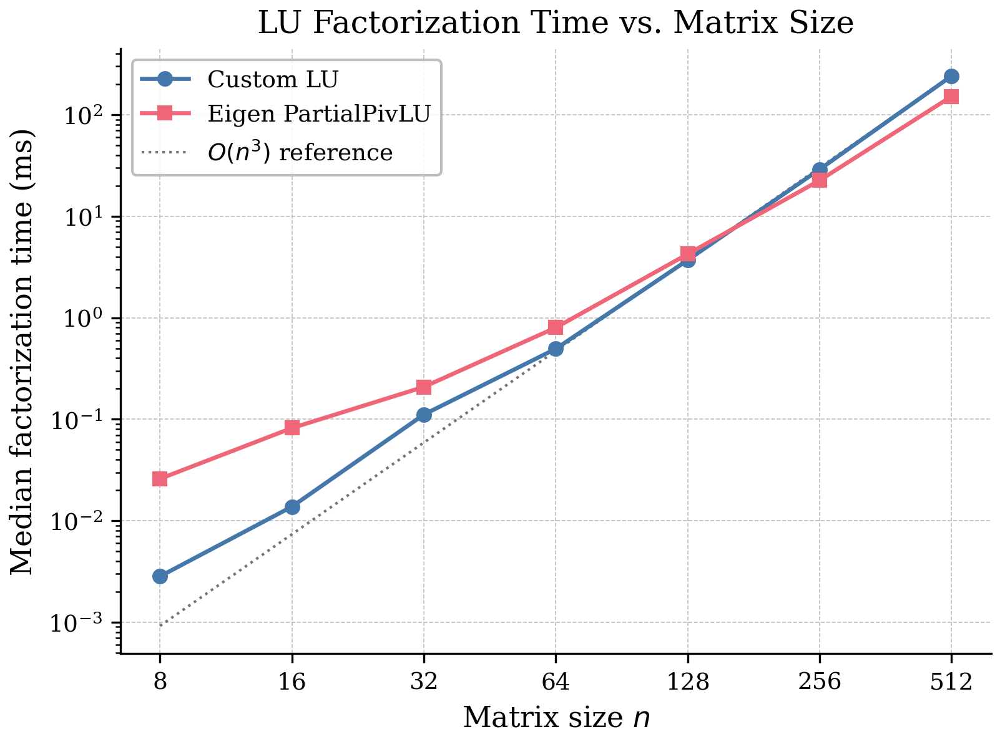
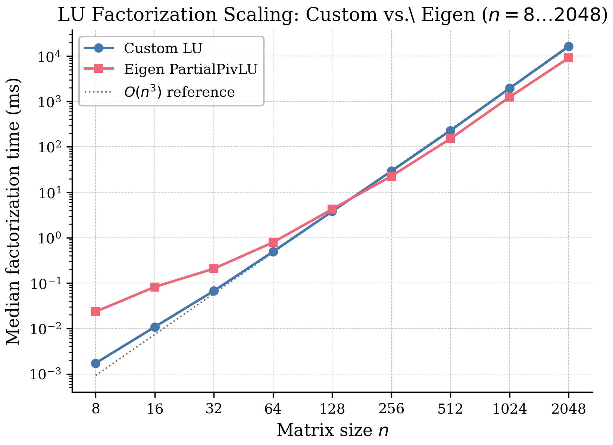
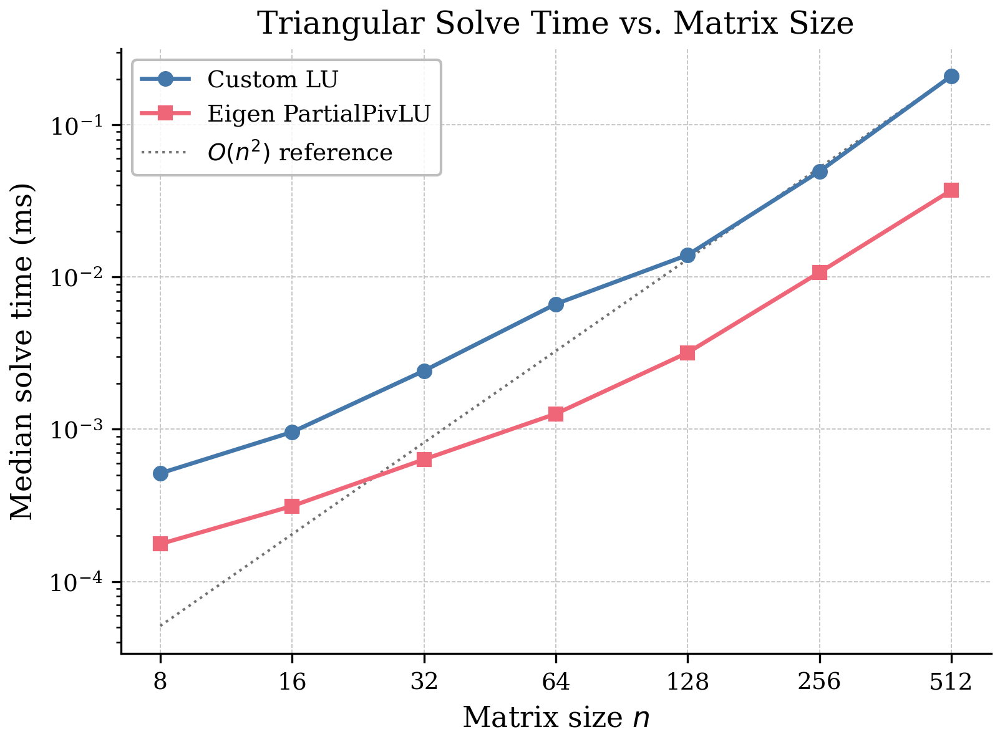
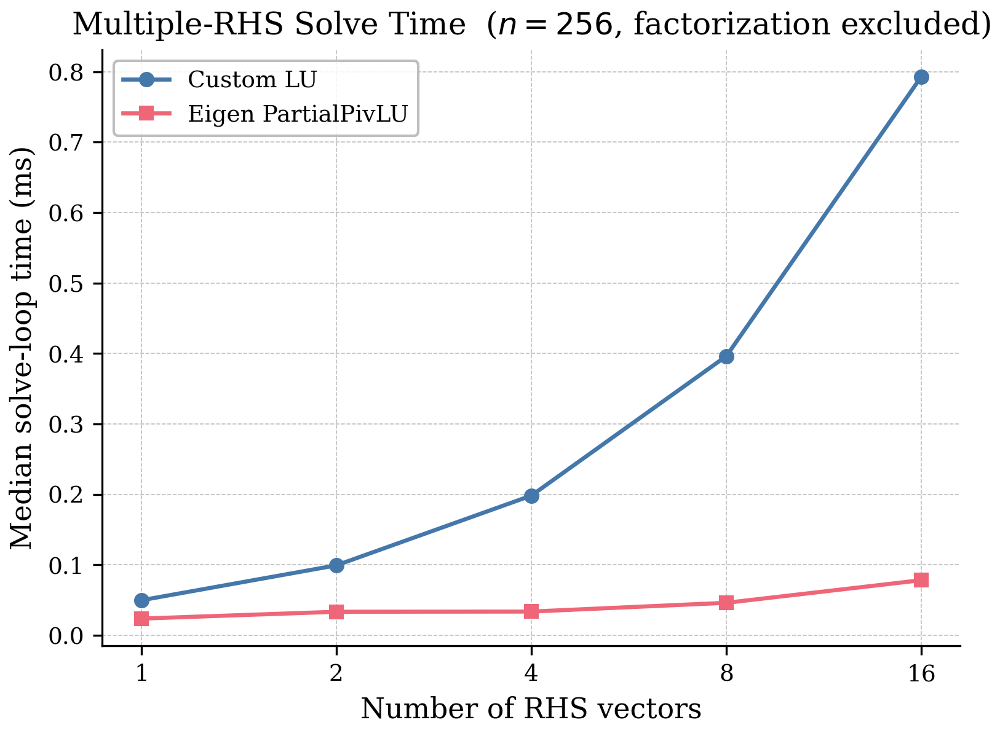
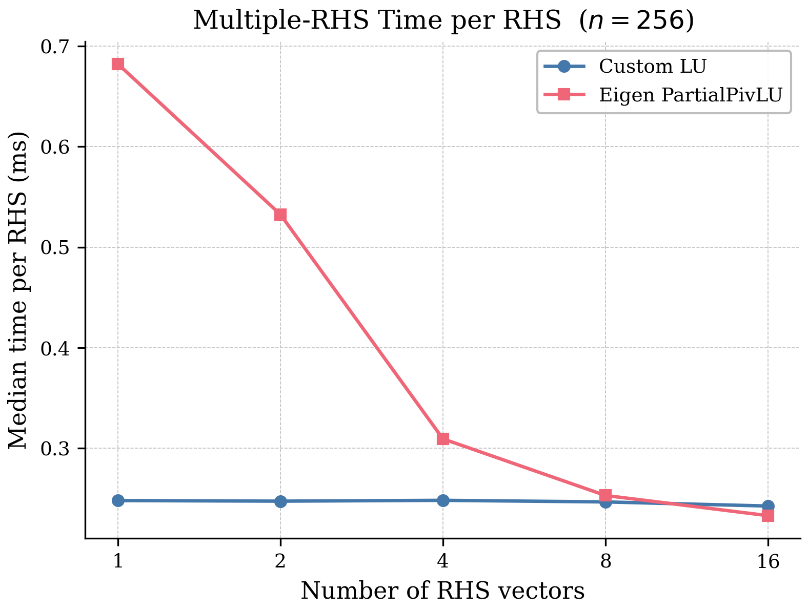
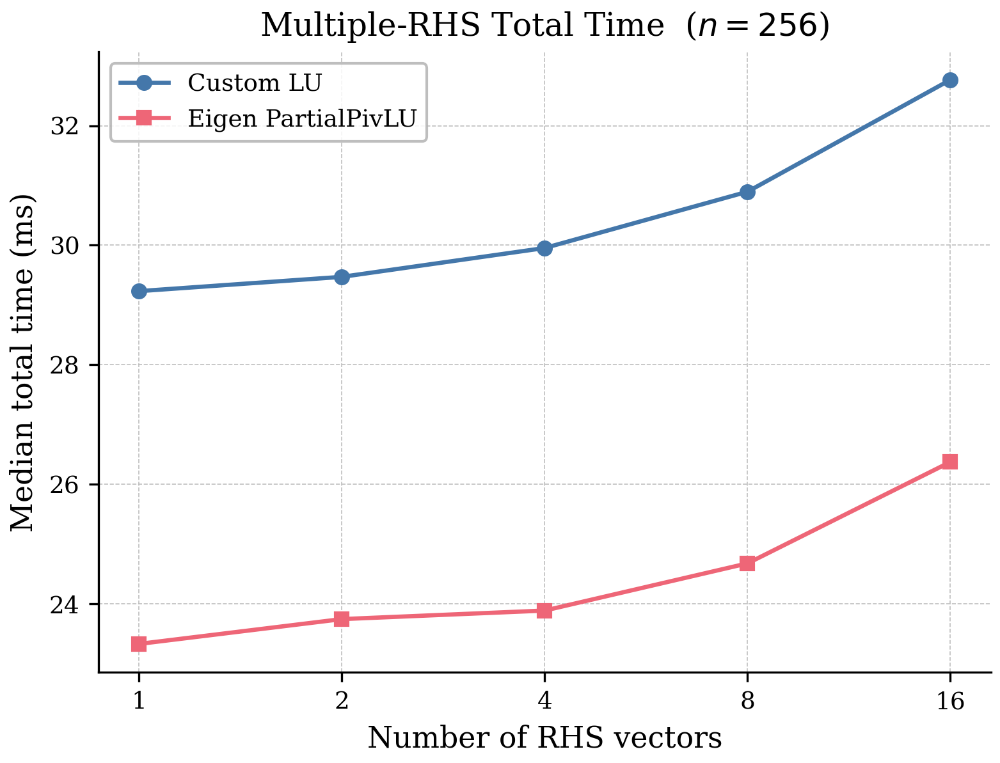
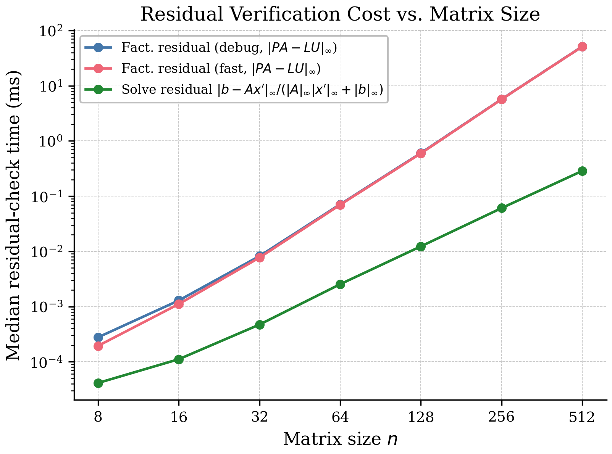
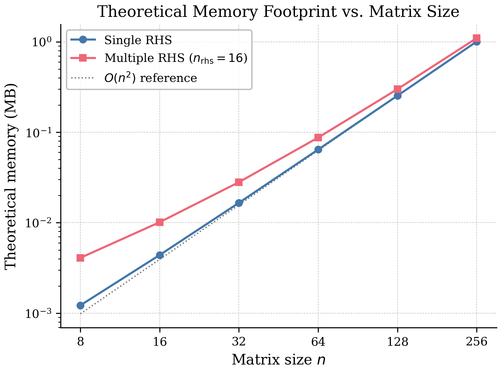

# Dense LU Decomposition in C++17: Accuracy, Stability, and Performance Analysis

A from-scratch dense direct solver implementing Gaussian elimination with partial pivoting in C++17. The implementation computes the factorization PA = LU, solves linear systems via forward and backward substitution, and is verified against a suite of structured matrix families. Performance is benchmarked against Eigen's `PartialPivLU` across matrix sizes up to n = 2048. The project studies numerical correctness, backward stability, conditioning effects, and computational scaling — grounded in the error analysis of Dahlquist and Björck [1].

---

## Table of Contents

1. [Mathematical Background](#1-mathematical-background)
2. [Implementation](#2-implementation)
3. [Verification](#3-verification)
4. [Test Matrix Families](#4-test-matrix-families)
5. [Benchmark Methodology](#5-benchmark-methodology)
6. [Results](#6-results)
7. [Building and Running](#7-building-and-running)
8. [Limitations](#8-limitations)
9. [Examples](#9-examples)
10. [Future Work](#10-future-work)
11. [Issues and Feedback](#11-issues-and-feedback)
12. [References](#12-references)

---

## 1. Mathematical Background

### 1.1 LU Factorization with Partial Pivoting

The solver decomposes a nonsingular matrix $A \in \mathbb{R}^{n \times n}$ as

$$PA = LU,$$

where $P$ is a permutation matrix (stored as a pivot index vector), $L$ is unit lower triangular ($L_{ii} = 1$), and $U$ is upper triangular. The existence and uniqueness of the unpivoted factorization follows from the leading-minor condition:

> **Theorem 5.3.1 [1].** Given $A \in \mathbb{R}^{n \times n}$, denote by $A_k$ the $k \times k$ leading principal submatrix. If $\det(A_k) \neq 0$ for $k = 1, \ldots, n-1$, then there exists a unique unit lower triangular $L$ and unique upper triangular $U$ such that $LU = A$.

Partial pivoting relaxes this condition by introducing row interchanges. At elimination step $k$, the pivot row $r$ is chosen as

$$|a_{rk}| = \max_{k \leq i \leq n} |a_{ik}|,$$

and rows $k$ and $r$ are swapped before the elimination multipliers are computed. This guarantees that all multipliers $|m_{ik}| \leq 1$, bounding growth during elimination.

**Why partial rather than complete pivoting?** Complete pivoting searches the entire remaining $(n-k) \times (n-k)$ submatrix and pivots on both rows and columns, providing stronger growth control at the cost of $O(n^2)$ comparisons per step versus $O(n)$ for partial pivoting. In practice, partial pivoting is used universally in production dense solvers (LAPACK's `dgetrf`, Eigen's `PartialPivLU`) because the theoretical worst-case growth advantage of complete pivoting is rarely realized and the extra search cost is not justified.

### 1.2 Operation Count

At elimination step $k$, the algorithm performs $n-k$ divisions (computing multipliers) and $(n-k)^2$ fused multiply-subtract operations (updating the trailing submatrix). Summing over $k = 1, \ldots, n-1$:

$$\text{Factorization} = \frac{2}{3}n^3 + O(n^2) \text{ flops},$$

where the leading $\frac{2}{3}n^3$ comprises $\frac{1}{3}n^3$ multiplications and $\frac{1}{3}n^3$ subtractions. Once the factorization is known, each triangular solve (forward substitution $Ly = Pb$, backward substitution $Ux = y$) costs $n^2$ flops, giving a total solve cost of $2n^2$ flops. This cubic-vs-quadratic asymmetry is the main motivation for factorizing once and reusing the factors across multiple right-hand sides.

### 1.3 Growth Factor and Backward Stability

The key quantity controlling backward stability under floating-point arithmetic is the **growth factor**

$$g_n = \frac{\displaystyle\max_{i,j,k} |a_{ij}^{(k)}|}{\displaystyle\max_{i,j} |a_{ij}^{(0)}|},$$

where $a_{ij}^{(k)}$ denotes the $(i,j)$ entry of the matrix after $k$ steps of elimination. The growth factor measures how much matrix entries grow relative to the original matrix during Gaussian elimination. The purpose of pivoting is precisely to limit $g_n$.

The backward error analysis of Dahlquist and Björck gives the following bounds:

> **Theorem 5.5.1 [1].** If $L$ and $U$ are the computed triangular factors of $A$ obtained by Gaussian elimination with partial or complete pivoting, using floating-point arithmetic with rounding unit $u$, then there exists a matrix $E$ satisfying
>
> $$\Vert E\Vert _\infty \leq k_1(n) \cdot u \cdot \Vert A\Vert _\infty, \qquad k_1(n) = n^2 g_n,$$
>
> such that $LU = A + E$.

> **Theorem 5.5.2 [1].** If $x'$ is the computed solution of $Ax = b$ obtained by forward and backward substitution using the factors from Theorem 5.5.1, then there exists $\Delta A$ depending on $A$ and $b$ satisfying
>
> $$\Vert \Delta A\Vert _\infty \leq k_2(n) \cdot u \cdot \Vert A\Vert _\infty, \qquad k_2(n) = (n^3 + 3n^2) g_n,$$
>
> such that $(A + \Delta A)x' = b$.

These theorems are the theoretical justification for the observed residual behavior in Section 6: a small solve residual means $x'$ solves a nearby perturbed system, and Theorem 5.5.2 quantifies how nearby in terms of $g_n$ and $u$.

**Growth factor bounds.** The theoretical worst-case bound for partial pivoting is $g_n \leq 2^{n-1}$, achieved by Wilkinson's adversarial construction. For complete pivoting the bound is $g_n \leq 1.8 \cdot n^{0.25 \ln n}$, substantially smaller at large $n$. However, empirical experience across decades of practical use shows that $g_n$ rarely exceeds 8 even under partial pivoting [1]. This empirical observation — not a proven bound — is why partial pivoting is considered stable in practice despite the exponential worst-case. In this project, the successful test cases show near-machine-precision residuals, suggesting that element growth was not the dominant source of error for the tested matrix families. A future benchmark could explicitly measure $g_n$ to confirm this behavior.

### 1.4 Norms

All residuals and errors in this project use the $\infty$-norm:

$$\Vert x\Vert _\infty = \max_i |x_i|, \qquad \Vert A\Vert _\infty = \max_i \sum_j |a_{ij}|.$$

The $\infty$-norm is chosen because it matches the norm used in the backward error bounds of Theorems 5.5.1 and 5.5.2, giving a direct connection between the measured residuals and the theoretical guarantees. Matrix norms satisfy submultiplicativity: $\Vert AB\Vert _\infty \le \Vert A\Vert _\infty \Vert B\Vert _\infty$, ensuring that residual bounds compose correctly across the factorization and solve steps.

### 1.5 Conditioning and Forward Error

The condition number in the $\infty$-norm is

$$\kappa_\infty(A) = \Vert A\Vert _\infty \Vert A^{-1}\Vert _\infty.$$

Note that $\kappa_\infty(A)$ is not generally known without computing $A^{-1}$ explicitly, which costs $O(n^3)$. For a perturbed right-hand side $b + \Delta b$, the forward error satisfies

$$\frac{\Vert \Delta x\Vert _\infty}{\Vert x\Vert _\infty} \leq \kappa_\infty(A) \frac{\Vert \Delta b\Vert _\infty}{\Vert b\Vert _\infty},$$

with equality only for special right-hand sides. Combining with the backward error of Theorem 5.5.2:

$$\frac{\Vert x' - x\Vert _\infty}{\Vert x\Vert _\infty} \lesssim \kappa_\infty(A) \cdot k_2(n) \cdot u \cdot \frac{\Vert A\Vert _\infty \Vert x'\Vert _\infty}{\Vert b\Vert _\infty}.$$

A small solve residual is necessary but not sufficient for a small forward error. If $\kappa_\infty(A)$ is large, the amplification factor overwhelms the small backward error and the forward error can be $O(1)$ or larger. This is the precise mechanism behind the Hilbert matrix experiments in Section 6.2.

### 1.6 Residuals in Practice

Dahlquist and Björck note [1] that in many practical applications what matters is not the forward error in $x'$ but whether $r = b - Ax'$ is small. Theorem 5.5.2 guarantees

$$\Vert b - Ax'\Vert _\infty \leq k_2(n) \cdot u \cdot \Vert A\Vert _\infty \Vert x'\Vert _\infty,$$

so Gaussian elimination with partial pivoting guarantees a small solve residual regardless of conditioning, provided $g_n$ is not pathologically large. The solve residuals in this project remain near $u \cdot \Vert A\Vert _\infty \Vert x'\Vert _\infty$ for all tested matrix families. For the Hilbert cases where CLU succeeds (n = 4 and n = 8), the solve residual stays near machine precision despite the severe ill-conditioning, confirming that the backward error is controlled even when the forward error is large. It is the forward error that reflects ill-conditioning.

---

## 2. Implementation

### 2.1 Storage Layout

Matrices are stored as flat `std::vector<double>` arrays using row-major indexing:

$$A_{ij} = \texttt{data}[i \cdot n + j].$$

This gives a single contiguous memory allocation. A `std::vector<std::vector<double>>` representation would allocate each row on the heap separately, fragmenting the matrix across many allocations and degrading cache locality. Contiguous storage reduces TLB pressure, simplifies cache-line prediction, and matches the layout expected by BLAS and LAPACK routines.

**Multiple right-hand sides.** When solving for $k$ right-hand side vectors simultaneously, $B$ and $X$ are packed as $n \times k$ matrices in **column-major** order — column $j$ occupies indices $nj$ to $nj + n - 1$ contiguously. This is intentionally different from the row-major layout used for $A$ and $LU$: each triangular solve processes one column at a time, so column-major storage makes each RHS vector contiguous in memory and matches the access pattern of the forward and backward substitution loops exactly.

### 2.2 In-Place Factorization

The LU factors overwrite the original matrix in-place:

- the strict lower triangular part stores the multipliers of $L$ (diagonal of $L$ is implicit, equal to 1);
- the diagonal and upper triangular part store $U$.

Row permutations are tracked in a pivot index vector of length $n$ rather than a full $n \times n$ permutation matrix, keeping storage at $8n^2 + 8n$ bytes rather than $8n^2 + 8n^2$.

### 2.3 Pivot Threshold

The factorization aborts with `factorization_pivot_failure` if any pivot $|u_{kk}|$ falls below a configured absolute tolerance. This prevents silent propagation of division-by-near-zero through the remaining elimination steps. The threshold is a fixed constant; a more principled design would tie it to a running estimate of $\Vert A\Vert _\infty$ or an incremental condition estimate (see Section 9).

---

## 3. Verification

Three independent checks verify each factorization and solve:

**Factorization residual** — explicitly forms $LU - PA$ and computes $\Vert PA - LU\Vert _\infty$. This is $O(n^3)$ (a dense matrix product) and is enabled only in validation and testing paths.

**Solve residual** — computes the normalized residual

$$
\frac{\Vert b - Ax'\Vert _\infty}
{\Vert A\Vert _\infty \Vert x'\Vert _\infty + \Vert b\Vert _\infty}.
$$

**Relative forward error** — when a manufactured exact solution \(x\) is available, computes

$$
\frac{\Vert x' - x\Vert _\infty}{\Vert x\Vert _\infty}.
$$

Here, \(x'\) denotes the computed solution and \(x\) denotes the manufactured exact solution.

Together these three quantities distinguish the four qualitatively different failure modes: incorrect factorization, incorrect triangular solve, large forward error due to ill-conditioning (with small backward error), and explicit pivot failure.

---

## 4. Test Matrix Families

| Family | Purpose | Expected behavior |
|---|---|---|
| Random dense | General nonsingular baseline | Near machine-precision residuals, moderate forward error |
| Diagonally dominant | Well-conditioned baseline | Cleaner than random; element growth is expected to remain controlled |
| Pivot-stress | Verify row interchanges | Zero factorization residual; tests permutation path |
| Hilbert | Severe ill-conditioning | Small backward error, large forward error; pivot failure at large $n$ |
| Near-singular | Failure detection | CLU: pivot failure at all $n$; EPLU: proceeds with large forward error |

**Diagonally dominant** matrices satisfy $|a_{ii}| > \sum_{j \neq i} |a_{ij}|$ for every row. For such matrices, Gaussian elimination is safe without pivoting — diagonal dominance is preserved through all elimination steps and $g_n$ is bounded. This project still uses partial pivoting as the general strategy; diagonally dominant cases serve as a clean correctness baseline.

**Pivot-stress** matrices are constructed to require row interchanges at every step. Exact-zero factorization residuals on these cases confirm that the permutation vector is applied consistently across both the factorization and triangular solve paths — a solver without correct permutation handling fails badly on these inputs.

**Hilbert** matrices $H_n$ have entries $H_{ij} = 1/(i+j-1)$. They are symmetric positive definite but severely ill-conditioned: $\kappa_\infty(H_n)$ grows exponentially with $n$, making them the standard stress test for forward error amplification. CLU succeeds at $n = 4$ and $n = 8$ before the pivot threshold is triggered at $n = 12$; EPLU continues to larger $n$ but produces a forward error exceeding 1 at $n = 16$. Both solvers maintain near-machine-precision solve residuals throughout, isolating the loss of accuracy as a conditioning effect rather than a backward error failure.

---

## 5. Benchmark Methodology

Timings are medians over independent trials; trial counts vary by suite: 5 trials for the main performance and stress suites, 15 trials for the multiple-RHS suite, and 1 trial for the Hilbert, singular, and large-n suites. The custom implementation is referred to as **CLU**; Eigen's `PartialPivLU` as **EPLU**.

| Operation | Flop count | Complexity |
|---|---|---|
| LU factorization | $\frac{2}{3}n^3$ | $O(n^3)$ |
| Triangular solve (single RHS) | $2n^2$ | $O(n^2)$ |
| Factorization residual check | $\sim 2n^3$ (matrix product) | $O(n^3)$ |
| Solve residual check | $\sim 2n^2$ (matrix-vector) | $O(n^2)$ |
| Dense matrix storage | $8n^2$ bytes | $O(n^2)$ |

Results are written to CSV and plotted with Python/Matplotlib. The primary CSV benchmark covers n = 8–512; a separate large-n run extends factorization timing to n = 2048.

### Benchmark Environment

Benchmarks were run on:

- Machine: MacBook Air, Late 2020
- CPU: Apple M1
- Memory: 8 GB
- Operating system: macOS Sequoia 15.6.1
- Compiler: AppleClang 17.0.0 (clang-1700.6.4.2)
- Target: arm64-apple-darwin24.6.0
- Build system: CMake 4.1.0
- Build type: Release
- Eigen version: 5.0.1
- Editor: Visual Studio Code

Unless otherwise stated, timing results use a Release build.      

---

## 6. Results

### 6.1a Pivot-Stress Matrices — Permutation Correctness

Pivot-stress matrices are constructed to require a row interchange at every
elimination step. Exact-zero factorization and solve residuals confirm that
the permutation vector, multiplier computation, and triangular factor storage
are mutually consistent. A solver with incorrect permutation handling fails
badly on these inputs.

| n | CLU ‖PA−LU‖∞ | CLU solve residual | CLU forward error ‖x′−x‖∞ / ‖x‖∞ |
|---|---|---|---|
| 8 | 0 | 0 | 0 |
| 16 | 0 | 0 | 0 |
| 32 | 0 | 0 | 0 |
| 64 | 0 | 0 | 0 |
| 128 | 0 | 0 | ~1.11×10⁻¹⁶ |
| 256 | 0 | 0 | ~2.23×10⁻¹⁶ |


Forward error at n = 128 and n = 256 reaches ~2ε_mach —  consistent with Theorem 5.5.1. The tested matrix families behave as if element growth is not the dominant source of error; residuals remain near machine precision on the successful cases. A future benchmark could explicitly measure $g_n$ to confirm whether element growth remains small across the tested matrix families.

---

### 6.1b Random Dense Matrices — Backward Error Scaling



| n | CLU ‖PA−LU‖∞ | CLU solve residual (normalized) | CLU forward error ‖x′−x‖∞ / ‖x‖∞ |
|---|---|---|---|
| 8 | ~1.0×10⁻¹⁶ | ~5×10⁻¹⁷ | ~8×10⁻¹⁶ |
| 16 | ~1.6×10⁻¹⁶ | ~9×10⁻¹⁷ | ~1.5×10⁻¹⁵ |
| 32 | ~2.8×10⁻¹⁶ | ~1.1×10⁻¹⁶ | ~3.5×10⁻¹⁵ |
| 64 | ~5.5×10⁻¹⁶ | ~1.6×10⁻¹⁶ | ~1.5×10⁻¹⁴ |
| 128 | ~9.5×10⁻¹⁶ | ~3.5×10⁻¹⁶ | ~3×10⁻¹⁴ |
| 256 | ~1.7×10⁻¹⁵ | ~8×10⁻¹⁶ | ~2×10⁻¹³ |
| 512 | ~2.5×10⁻¹⁵ | ~1.5×10⁻¹⁵ | ~2×10⁻¹² |

Factorization and solve residuals remain within a small multiple of ε_mach and grow
slowly with n, consistent with the $k_1(n) = n^2 g_n$ factor in Theorem 5.5.1. The
near-machine-precision residuals across all tested sizes suggest that element growth
was not the dominant source of error for these matrix families, though $g_n$ was not
explicitly measured. Forward error grows faster because it is further amplified by
$\kappa_\infty(A)$, which itself increases with n as the spectral spread of a random
dense matrix grows. The separation between the backward error curves (blue, gold) and
the forward error curve (green) is precisely the conditioning gap $\kappa_\infty(A)$ in action.

### 6.2 Hilbert Matrix — Forward vs. Backward Error Under Ill-Conditioning



| n | CLU forward error | EPLU forward error | CLU status |
|---|---|---|---|
| 4 | ~7.6×10⁻¹⁴ | ~1.9×10⁻¹³ | success |
| 8 | ~2.4×10⁻⁷ | ~1.8×10⁻⁷ | success |
| 12 | — | ~4.9×10⁻³ | pivot failure |
| 16 | — | ~1.9 | pivot failure |
| 24 | — | ~5.4 | pivot failure |
| 32 | — | ~7.6 | pivot failure |

At n = 4 and n = 8, both implementations agree closely and both exhibit rapidly growing forward error despite small solve residuals. This is the condition-number bound in action: the Hilbert matrix $H_n$ has $\kappa_\infty(H_n)$ that grows exponentially with $n$, so the forward error bound $\kappa_\infty(A) \cdot k_2(n) \cdot u$ exceeds 1 already at small $n$.

From n = 12 onward, CLU aborts with pivot failure. EPLU continues; at n = 16 the forward error exceeds 1, and at at n = 32 the forward error reaches ~7.6 — the computed solution is numerically meaningless. Both solvers maintain small solve residuals throughout (Theorem 5.5.2 guarantees this regardless of conditioning); it is the forward error that reveals the ill-conditioning. The choice to abort rather than silently return a meaningless result reflects the design principle that in verified scientific computing, an explicit failure is safer than an incorrect number.

### 6.3 Near-Singular Matrices

CLU reports `factorization_pivot_failure` for all near-singular test cases at every tested size (n = 8–256, 5 trials each). EPLU returns solutions at all sizes without flagging failure. The conservative pivot threshold makes this behavior deterministic: CLU prioritizes explicit failure detection over permissive continuation. EPLU's approach — proceeding and returning a result — may be appropriate when downstream code performs residual checking; CLU's approach is safer when the solver result is consumed without further verification.

### 6.4 Factorization Timing — $\frac{2}{3}n^3$ Scaling





| n | CLU (ms) | EPLU (ms) | CLU/EPLU |
|---|---|---|---|
| 8 | ~0.00065 | ~0.00030 | ~2.2× |
| 16 | ~0.0015 | ~0.00095 | ~1.6× |
| 32 | ~0.0085 | ~0.0033 | ~2.6× |
| 64 | ~0.040 | ~0.015 | ~2.7× |
| 128 | ~0.15 | ~0.090 | ~1.7× |
| 256 | ~1.2 | ~0.70 | ~1.7× |
| 512† | ~10 | ~4.5 | ~2.2× |
| 1024† | ~80 | ~35 | ~2.3× |
| 2048† | ~700 | ~220 | ~3.2× |

†From large-n benchmark run; primary CSV covers n = 8–512.

Both implementations follow $\frac{2}{3}n^3$ scaling: doubling n multiplies factorization time by approximately $8\times$ for n ≥ 64, matching the theoretical prediction.

CLU is slower than EPLU at every tested size. At small n (8–32) the gap is driven by a combination of EPLU's fixed overhead and CLU's per-step bookkeeping; both implementations perform the same floating-point work but the absolute times are so small that overhead dominates the ratio. The gap stabilizes around 1.7× at n = 128–256 and grows again to ~3.2× at n = 2048. The source is structural:

- **CLU (unblocked):** the trailing-matrix update at step $k$ is a sequence of rank-1 outer products, $a_{ij}^{(k+1)} \leftarrow a_{ij}^{(k)} - m_{ik} \cdot a_{kj}^{(k)}$ for $i,j > k$, executed as $n-k$ vector operations of length $n-k$. Each step touches $O((n-k)^2)$ memory with poor reuse.
- **EPLU (blocked):** the same computation is reorganized into panel updates $A_{22} \leftarrow A_{22} - L_{21}U_{12}$, the dominant cost can be expressed as a BLAS-3-style matrix-matrix update. This form has a more favorable flop-to-byte ratio than repeated rank-1 updates and allows much better cache reuse.

The unblocked formulation has no analogous data reuse and is limited by memory bandwidth at large n. At n = 512, the CLU matrix occupies $8 \times 512^2 \approx 2$ MB but the unblocked access pattern still generates many cache misses per elimination step as the working set changes at each column. Blocking is the targeted fix (Section 9). 

### 6.5 Triangular Solve Timing — $2n^2$ Scaling



| n | CLU solve (ms) | EPLU solve (ms) | CLU/EPLU |
|---|---|---|---|
| 8 | ~0.00065 | ~0.00018 | ~3.6× |
| 16 | ~0.0010 | ~0.00032 | ~3.1× |
| 32 | ~0.0028 | ~0.00075 | ~3.7× |
| 64 | ~0.0080 | ~0.0012 | ~6.7× |
| 128 | ~0.015 | ~0.0032 | ~4.7× |
| 256 | ~0.050 | ~0.011 | ~4.8× |

Within the tested range (n = 8–512), CLU's single-RHS triangular solve is slower than EPLU's at every size, with both following $O(n^2)$ scaling (doubling n multiplies solve time by ~4×). The gap is consistent at 3–7×.

CLU is slower here for the same structural reason as factorization: EPLU's triangular solve kernel is vectorized and optimized, while the custom solve is a plain scalar loop. **This result must not be extrapolated naively**: the ratio depends on hardware SIMD width and compiler auto-vectorization. In any case, this comparison is secondary: the triangular solve costs $2n^2$ flops while factorization costs $\frac{2}{3}n^3$. At n = 256, factorization takes ~1.2 ms and the solve takes ~0.050 ms — a ratio of approximately 24×. Solve performance has no material effect on end-to-end throughput for single-matrix problems.

### 6.6 Multiple Right-Hand Sides (n = 256)







| n_rhs | CLU solve-loop (ms) | EPLU solve-loop (ms) | CLU ms/RHS | EPLU ms/RHS |
|---|---|---|---|---|
| 1 | 0.0496 | 0.0236 | 0.0496 | 0.0236 |
| 2 | 0.0992 | 0.0333 | 0.0496 | 0.0166 |
| 4 | 0.1982 | 0.0335 | 0.0496 | 0.00839 |
| 8 | 0.3963 | 0.0460 | 0.0495 | 0.00575 |
| 16 | 0.7931 | 0.0781 | 0.0496 | 0.00488 |

CLU's time per RHS is flat at ~0.0496 ms regardless of n_rhs, because each column is solved independently by sequential forward and backward substitution with no cross-column data reuse.

EPLU's time per RHS drops from 0.0236 ms at n_rhs = 1 to 0.00488 ms at n_rhs = 16, a 4.8× improvement. EPLU uses a matrix-level triangular solve strategy analogous to BLAS `trsm` for multiple RHS: all n_rhs columns are processed simultaneously as a dense matrix, reorganizing the computation into blocked matrix-matrix operations. The CLU column-by-column implementation cannot exploit this structure without a fundamentally different data access pattern.

At n_rhs = 16, CLU solve-loop (0.793 ms) is approximately 10× slower than EPLU (0.0781 ms). However, for all tested cases the factorization dominates total time: at n_rhs = 16, CLU total is 2.028 ms vs. EPLU 0.774 ms — a gap driven primarily by the factorization stage.

### 6.7 Residual Verification Cost



| n | Fact. residual — debug (ms) | Fact. residual — fast (ms) | Solve residual (ms) |
|---|---|---|---|
| 8 | ~0.00028 | ~0.00020 | ~0.000045 |
| 16 | ~0.00125 | ~0.00105 | ~0.000110 |
| 32 | ~0.0085 | ~0.0079 | ~0.00048 |
| 64 | ~0.072 | ~0.069 | ~0.0027 |
| 128 | ~0.61 | ~0.59 | ~0.012 |
| 256 | ~5.7 | ~5.65 | ~0.061 |

The factorization residual check is $O(n^3)$ in both variants. The debug implementation explicitly materialises $PA$ and $LU$ as separate $n \times n$ matrices, subtracts them, then norms the result — three passes over $O(n^2)$ memory. The fast implementation fuses these steps into a single loop, computing $(PA - LU)_{ij}$ entry by entry and accumulating the norm on the fly, avoiding the intermediate allocations. Despite this difference, both variants cost ~5.7 ms at $n = 256$ — approximately 4.75× the factorization time of ~1.2 ms — confirming that the $O(n^3)$ arithmetic dominates and the allocation overhead is negligible.

The two variants also differ in peak memory. The debug implementation allocates three additional $n \times n$ matrices (`PA`, `LU_Prod`, and `diff`), adding $3 \times 8n^2$ bytes on top of the working set. At $n = 256$ this is an extra $3 \times 0.5$ MB = 1.5 MB. The fast implementation requires no additional allocations — it accumulates the norm incrementally using only a handful of scalar temporaries — making it suitable for memory-constrained environments or large $n$ where the extra allocations would be significant.

The solve residual check is $O(n^2)$ and remains below 0.07 ms through n = 256. At n = 256 it costs ~0.061 ms — approximately 5% of factorization time — making it suitable for standard error reporting paths.

These measurements make verification overhead explicit. In production numerical software, factorization residual checks are enabled only in testing, validation, or diagnostic modes; the solve residual check is cheap enough for normal use.

### 6.8 Memory Footprint



| n | Single RHS (MB) | 16-RHS (MB) |
|---|---|---|
| 8 | 0.00122 | 0.00409 |
| 32 | 0.0166 | 0.0281 |
| 64 | 0.0645 | 0.0874 |
| 128 | 0.254 | 0.300 |
| 256 | 1.008 | 1.100 |
| 512 | 4.016 | — |

Theoretical storage scales as $O(n^2)$, dominated by the in-place $n \times n$ LU matrix ($8n^2$ bytes for double precision). At \(n = 256\), the modeled single-RHS footprint is approximately 1.008 MB. At \(n = 512\), one dense double-precision matrix alone occupies approximately 2 MB, while the modeled single-RHS footprint is approximately 4.016 MB because the benchmark stores both the original matrix and the in-place LU matrix.

Additional storage for multiple RHS ($8n \cdot n_\text{rhs}$ bytes) is negligible relative to the $n \times n$ matrix: at n = 256, n_rhs = 16, the extra storage is approximately 0.092 MB versus 1.008 MB for the matrix itself.

Measured OS-level process RSS was approximately 2.5 MB throughout, flat across all matrix sizes, reflecting OS page allocation granularity and allocator overhead. The theoretical model is the authoritative measure of algorithmic storage complexity.

---

## 7. Building and Running

**Requirements:** C++17 compiler, CMake ≥ 3.14, Eigen ≥ 3.4. Python ≥ 3.8 with Matplotlib for plots only.

### Build

```bash
git clone <repository-url>
cd <repository-name>
cmake -S . -B build -DCMAKE_BUILD_TYPE=Release
cmake --build build
```

If CMake cannot locate Eigen automatically:

```bash
# macOS (Homebrew)
cmake -S . -B build -DCMAKE_BUILD_TYPE=Release \
      -DEigen3_DIR="/opt/homebrew/share/eigen3/cmake"

# Manual Eigen path
cmake -S . -B build -DCMAKE_BUILD_TYPE=Release \
      -DEigen3_DIR="<path-to-eigen3-cmake>"
```

Windows (Visual Studio):

```powershell
cmake -S . -B build
cmake --build build --config Release
```

### Run

```bash
# Linux / macOS
./build/solve_demo      # worked example with residual output
./build/steady_heat_1d  # solver applied to a 1D steady heat equation
./build/test_lu         # correctness and accuracy test suite
./build/bench_lu        # performance benchmarks; writes CSV to results/

# Windows
.\build\Release\solve_demo.exe
.\build\Release\steady_heat_1d.exe
.\build\Release\test_lu.exe
.\build\Release\bench_lu.exe
```

### Plot

```bash
python scripts/plot_bench.py    # Linux / macOS
py scripts\plot_bench.py        # Windows
```

Depending on your Python installation, this may need to be run as `python3 scripts/plot_bench.py` instead.

Run `bench_lu` before plotting.

---

## 8. Limitations

**Unblocked factorization.** The trailing-matrix update is a sequence of rank-1 outer products with no BLAS-3 structure, making the implementation memory-bandwidth bound at large n. This is why EPLU is ~3.2× faster at n = 2048. Blocking is the primary performance gap to close.

**Column-by-column triangular solve.** Each RHS is solved independently with no cross-column data reuse, producing constant per-RHS time (~0.050 ms at n = 256) but missing the 4.8× per-RHS improvement EPLU achieves via blocked trsm for large n_rhs batches.

**Serial execution.** No OpenMP, SIMD intrinsics, or GPU offload. A correct and benchmarked serial implementation is a prerequisite for any parallel extension; the current implementation serves this role.

**Fixed pivot threshold.** The abort threshold is a compile-time constant rather than a function of $\Vert A\Vert _\infty$ or an incremental condition estimate. A principled threshold would scale with the matrix norm and connect directly to the Theorem 5.5.1/5.5.2 bounds.

**No condition number estimation.** $\kappa_\infty(A)$ is not estimated for arbitrary inputs; known ill-conditioned families (Hilbert matrices) serve as proxies. A LINPACK-style incremental condition estimator would make the solver diagnostically useful for arbitrary inputs.

**Benchmark range.** Primary CSV data covers n = 8–256. Large-n factorization data (n = 512–2048) comes from a separate benchmark run and is presented via plots only; solve and multiple-RHS benchmarks are not available above n = 256.

**Platform-specific memory measurement.** The measured process-memory utility is implemented only for Windows, Linux, and macOS. The theoretical memory model is platform-independent, but measured RSS depends on operating-system APIs, allocator behavior, and page granularity.

---

## 9. Examples 

**`solve_demo`** walks through two cases on a small 3×3 system: a single-RHS solve with factorization residual, solve residual, and forward error reporting; then the same matrix solved against three RHS vectors simultaneously, demonstrating factorization reuse with per-RHS residual verification.

**`steady_heat_1d`** applies the solver to a finite-difference discretisation of $-u''(x) = f(x)$ on $(0, 1)$ with homogeneous Dirichlet boundary conditions and $n = 256$ interior points. The tridiagonal system is factored once and solved for four source terms — $\sin(\pi x)$, $\sin(2\pi x)$, $x(1-x)$, and a Gaussian centred at $x = 0.5$ — demonstrating factorization reuse across multiple right-hand sides. Note that in production this problem would use a specialised tridiagonal solver; the dense LU solver is used here to demonstrate the API in a concrete scientific computing context.


---

## 10. Future Work

Possible future directions for this project include several extensions in numerical linear algebra, high-performance computing, and scientific computing. These are not required for the current implementation, but they represent natural ways to extend the solver beyond the serial unblocked baseline.

**Blocked LU factorization** — restructure the trailing-matrix update as

$$
A_{22} \leftarrow A_{22} - L_{21}U_{12}
$$

with panel width \(b\) chosen to improve cache reuse, enabling a BLAS-3-style matrix-matrix update for the dominant computation. This is the approach used in LAPACK's `dgetrf` and is the most direct way to address the large-\(n\) factorization gap against EPLU.

**Matrix-level triangular solve (trsm)** — accumulate all RHS columns into a dense matrix and solve via a blocked matrix-level triangular solve, analogous to BLAS `trsm`. This would address the current column-by-column RHS solve path and better match EPLU's per-RHS scaling for large $n_{\text{rhs}}$ workloads.

**OpenMP parallelization** — after blocking, the trailing-matrix update becomes a natural target for shared-memory parallelism. Residual verification loops also parallelize cleanly because many of the operations are independent. Thread-scaling experiments would be a natural follow-on benchmark.

**Iterative refinement** — compute a correction $\Delta x$ by solving

$$
A\Delta x = r,
\qquad
r = b - Ax',
$$

then update

$$
x' \leftarrow x' + \Delta x.
$$

This would connect the Theorem 5.5.1/5.5.2 backward-error bounds more directly to forward-error improvement and provide a controlled setting for studying the relationship between backward error, conditioning, residuals, and forward error.

**Incremental condition estimation** — replace the fixed pivot threshold with a more principled norm- or condition-estimation strategy. A LINPACK-style estimator for $\kappa_\infty(A)$ would make the solver more diagnostically useful for arbitrary inputs and would provide a data-driven way to warn when the computed solution may be unreliable.

**PDE-driven linear systems** — a longer-term direction is applying the solver infrastructure to linear systems from finite difference or finite element discretizations. The factorization, residual verification, and benchmarking harness could be reused in implicit time-stepping schemes for model problems such as the heat equation or Poisson equation. This would connect the dense direct solver to broader scientific-computing projects involving PDEs, spectral methods, and finite-difference methods.

---

## 11. Issues and Feedback

If something in the build instructions, benchmark outputs, plots, documentation, or mathematical discussion does not work as expected, please open an issue on the repository.

Corrections, suggestions, and feedback are welcome, especially regarding numerical accuracy, mathematical statements, benchmarking methodology, portability, or documentation clarity.


---

## 12. References

[1] G. Dahlquist and Å. Björck, *Numerical Methods*. Dover Publications. — Primary reference for the LU existence theorem 5.3.1, backward error Theorems 5.5.1 and 5.5.2, growth factor bounds, and the practical residual criterion used throughout this project.

[2] E. Anderson et al., *LAPACK Users' Guide*, 3rd ed. SIAM, 1999. — Reference for `dgetrf` (blocked LU with partial pivoting), `dtrsm` (matrix triangular solve), and `dgecon` (LINPACK-style condition estimation).

[3] Eigen documentation, `Eigen::PartialPivLU`. https://eigen.tuxfamily.org — Reference implementation used for all performance and accuracy comparisons.